  
# Alejandro Bermúdez Bedoya

### Estudiante de Ingeniería de Sistemas

---

## Sobre Mí

Estudiante de **Ingeniería de Sistemas** con enfoque en **Desarrollo Web** y **DevOps**. Interesado en la construcción de aplicaciones web modernas y escalables.

**Áreas de interés:**
- Arquitectura de Software
- Desarrollo Full Stack
- Diseño UI/UX
- DevOps
- RPA

---

## Tecnologías y Herramientas

### Lenguajes de Programación

### Frameworks y Librerías

### Bases de Datos

### Herramientas y Plataformas

---

## Estadísticas de GitHub

---

## Actividad de Contribución

---

## Contacto

